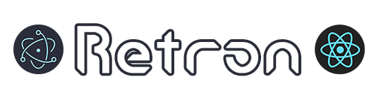

<div align="center">


## Electron + React + Material-UI Template

[](https://github.com/mui-org/material-ui/blob/master/LICENSE)


[](https://github.com/jooy2)

This is a skeleton project for easily creating React-based Electron projects.

It comes with several useful modules, including React.
</div>

# Components
 - **React 17.x**
   - redux (Global state management)
   
 - **Electron 15**
   - electron-builder (Package builder)
   - electron-store (Local storage)

 - **Material-UI 5**
   - @mui/material (Material Design CSS Framework)
   
 - **i18n + i18next**
   - i18next (Multilingual translation)

 - **ESLint 7.x**
   - eslint (Code syntax checking)
   - eslint-plugin-react-hooks

# Install
Clone this repo using below command.
```shell
$ git clone https://github.com/jooy2/retron <PROJECT_NAME>
```

Then, install the dependency module.
```shell
$ npm i
```

You can test your project in the development environment using the following command:
```shell
$ npm run dev
```

# Build
Retron can build targeting Windows 7, 8.1, 10 or later, macOS 14.x or later, and major Linux distributions.

### Windows
```shell
$ npm run build:win
```

### macOS
```shell
$ npm run build:mac
```

### Linux
```shell
$ npm run build:linux
```

# Contribute
You can report issues on Github Issue. You can also request a pull to fix bugs and add frequently used features.

# License
Copyright © 2021 jooy2 Released under the MIT license.
