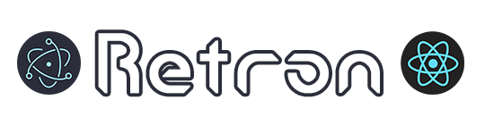

<div align="center">



## Vite + Electron + React + Material-UI Template

> [](https://github.com/jooy2/retron/blob/master/LICENSE)      [](https://github.com/jooy2) 

This is a skeleton template for easily creating React-based Electron projects.

It is configured to experience fast development and build speed using Vite bundler. As a bonus, it includes several React utilities and layout configurations.

</div>

## Components

- **Vite 4.x**

- **React 18.x**

  - `redux` (Global state management)

- **TypeScript 4.x**

- **Electron 22**

  - `electron-builder` (Package builder)
  - `electron-store` (Local storage)

- **Material-UI 5**

  - `@mui/material` (Material Design CSS Framework)

- **i18n + i18next**

  - `i18next` (Multilingual translation)

- **ESLint 8.x**

  - `eslint` (Code syntax checking)
  - `eslint-plugin-react-hooks`

## Installation

You can easily clone a repository with just the npm command. (Recommend)

```shell
$ npm init retron
```

OR, Click **[Use this template](https://github.com/jooy2/retron/generate)** to instantly create your own project.

OR, Clone this repo using below command.

```shell
$ git clone https://github.com/jooy2/retron <PROJECT_NAME>
```

Then, install the dependency module.

```shell
# via npm
$ npm i

# via yarn (https://yarnpkg.com)
$ yarn install

# via pnpm (https://pnpm.io)
$ pnpm i
```

You can test your project in the development environment using the following command:

```shell
$ npm run dev
```

## Build

Retron can build targeting Windows 7, 8.1, 10 or later, macOS 14.x or later, and major Linux distributions.

```shell
# For Windows (.exe, .appx)
$ npm run build:win

# For macOS (.dmg)
$ npm run build:mac

# For Linux (.rpm, .deb, .snap)
$ npm run build:linux
```

The built packages can be found in `release/{version}` location.

### Build settings for projects that use Native Node modules

For projects that use the **Native Node Module**, add the following script to your `package.json`: When installing dependencies, `electron-builder` will take care of any modules that require rebuilding.

```json
{
  "scripts": {
    "postinstall": "electron-builder install-app-deps"
  }
}
```

### What do I need to do for a multi-platform build?

**macOS** is recommended if you want to build multiple platforms simultaneously on one platform. Because it can be configured with just a few very simple settings.

You can perform multi-platform builds at once with the following command. Alternatively, you can just do it for the OS you want via the individual build commands above.

```shell
$ npm run build
```

## Looking for Electron templates made with Vue?

Also check out the `Vutron` project, which consists of Vite + Vue 3 + Vuetify + Electron.

https://github.com/jooy2/vutron

## Contribute

You can report issues on [Github Issue](https://github.com/jooy2/retron/issues). You can also request a pull to fix bugs and add frequently used features.

## License

Copyright © 2021-2022 [Jooy2](https://jooy2.com) <[jooy2.contact@gmail.com](mailto:jooy2.contact@gmail.com)> Released under the MIT license.
