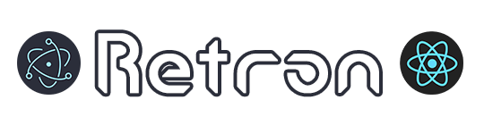

<div align="center">



## Vite + Electron + React + Material-UI Template

> [](https://github.com/jooy2/retron/blob/main/LICENSE)     [](https://github.com/jooy2) 

This is a skeleton template for easily creating React-based Electron projects.

It is configured to experience fast development and build speed using **[Vite](https://vitejs.dev)** bundler. As a bonus, it includes several React utilities and layout configurations.

</div>

## Advantages of use

- ✅ You can build immediately without any presets, so you can develop quickly.
- ✅ It is being maintained quickly to be compatible with the latest `React` and `Electron`, as well as many modules.
- ✅ There is no need to worry about layout and data management by using various additional templates.

## Features

- ⚡️ Rapid development through hot-reload
- ⚡️ Cross-platform development and build support
- ⚡️ Support for automated application testing
- ⚡️ TypeScript support
- ⚡️ Multilingual support
- ⚡️ Support for themes (dark & light)
- ⚡️ Basic layout manager
- ⚡️ Global state management through the Redux store
- ⚡️ Shared `src/common` folder for what both processes need, kept process-agnostic by lint rules
- ⚡️ Quick support through the GitHub community

## Components

- **For compile & build**
  - `vite`
  - `electron`
  - `electron-builder` (Package builder)

- **For web development framework**
  - `react`
  - `react-dom`
  - `react-router-dom`
  - `@redux/toolkit` & `react-redux` (Global state management)
  - `typescript`

- **For CSS Design**
  - `@mui/material` (Material Design CSS Framework)
  - `@emotion/react`

- **For Multilingual language support**
  - `i18next` (Multilingual translation)

- **For development utils**
  - `eslint` (Code syntax checking)
  - `eslint-plugin-react-hooks`
  - `prettier`

- **For testing**
  - `playwright`

## Requirements

- **Node.js** `22.12.0` or later (required by `electron@42` and `vite@8`)
- One of `npm`, `yarn` or `pnpm`

## Installation

You can easily clone a repository with just the npm command. (Recommend)

```shell
$ npm init retron
```

OR, Click **[Use this template](https://github.com/jooy2/retron/generate)** to instantly create your own project.

OR, Clone this repo using below command.

```shell
$ git clone https://github.com/jooy2/retron <PROJECT_NAME>
```

Then, install the dependency module.

```shell
# via npm
$ npm i

# via yarn (https://yarnpkg.com)
$ yarn install

# via pnpm (https://pnpm.io)
$ pnpm i
```

You can test your project in the development environment using the following command:

```shell
$ npm run dev
```

## Scripts

| Command              | Description                                                             |
| -------------------- | ----------------------------------------------------------------------- |
| `npm run dev`        | Start the Vite dev server and launch Electron with hot-reload           |
| `npm run lint`       | Report ESLint problems                                                  |
| `npm run lint:fix`   | Report ESLint problems and fix the ones that can be fixed automatically |
| `npm run format`     | Check that every file follows the Prettier code style                   |
| `npm run format:fix` | Rewrite every file with the Prettier code style                         |
| `npm run test`       | Build the app and run the Playwright end-to-end suite                   |
| `npm run test:linux` | Same as `npm run test`, wrapped in `xvfb-run` for headless Linux        |
| `npm run build`      | Build a distributable package for the current platform                  |

`npm run build:pre` runs on its own before every build target. It type-checks the renderer, the main process, the preload script and the shared code with `tsc -b`, then bundles the app with Vite.

## Project structure

An Electron app runs in more than one process, and each one has different privileges. Knowing which directory belongs to which process is the first thing to learn about this template.

```
src
├── common       Code every process shares. No Node.js, no Electron, no React.
│   ├── ipc.ts         Channel names and the type of `window.mainApi`
│   └── locales.ts     Supported languages and their display names
├── main         Main process. Full Node.js access: windows, menus, files, IPC handlers.
│   ├── index.ts       Application entry point (`main` field of package.json)
│   ├── index.dev.ts   Development-only extensions, stripped from release builds
│   └── IPCs.ts        Every `ipcMain` handler lives here
├── preload      Bridge between the two processes. Runs before the page scripts.
│   └── index.ts       Exposes `window.mainApi` through `contextBridge`
├── renderer     The React application. Sandboxed, no Node.js access.
│   ├── assets         Global styles
│   ├── components     Reusable components
│   ├── screens        One component per route
│   ├── store          Redux Toolkit store, slices and pre-typed hooks
│   ├── public         Static files copied as-is (images, translations)
│   ├── i18n.ts        i18next setup
│   └── index.html     Renderer entry point, including the Content Security Policy
└── global.d.ts  Declares `window.mainApi` for the renderer

buildAssets
├── builder      electron-builder configuration
└── installer    Installer icons

tests           Playwright end-to-end suite
```

The renderer is deliberately unprivileged: `nodeIntegration` is off and `contextIsolation` is on. Anything that needs the operating system has to go through IPC.

### Sharing code between the processes

Some code belongs to neither side: an IPC channel name, a payload type, a validation rule, a pure helper. That goes in `src/common`, which all three builds import through the same `@` alias.

```ts
// Same import in src/main, src/preload and src/renderer
import { mainChannels } from '@/common/ipc';
```

Two things to keep in mind when adding your own:

- **Only what runs everywhere.** The renderer has no Node.js and no Electron, the main process has no DOM and no React. So `src/common` may not import a Node.js builtin, `electron` or a renderer library, and may not touch `window`, `navigator` or `process`. Type-only imports (`import type { IpcRendererEvent } from 'electron'`) are erased at build time and are fine. ESLint fails the build on the rest, so a mistake shows up while you write it rather than at runtime.
- **Each process gets its own copy.** The three bundles are built separately, so a variable exported from `src/common` is not one shared value: changing it in the renderer leaves the main process copy untouched. Keep `src/common` to constants, types and pure functions, and pass state over IPC.

## Adding an IPC channel

Channels are whitelisted, so a new one takes two steps. Skipping the first fails fast with `Unknown ipc channel name`.

**1. Declare the channel name** in `src/common/ipc.ts`. `mainChannels` is Renderer → Main, `rendererChannels` is Main → Renderer. The preload whitelist is built from these lists, so there is nothing to add there.

```ts
export const mainChannels = {
  requestGetVersion: 'msgRequestGetVersion',
  readConfigFile: 'msgReadConfigFile',
} as const;
```

**2. Handle it in the main process** in `src/main/IPCs.ts`.

```ts
ipcMain.handle(mainChannels.readConfigFile, async (event, path: string) => readFile(path, 'utf8'));
```

The renderer can then call it, fully typed:

```ts
const config = await window.mainApi.invoke(mainChannels.readConfigFile, '/etc/hosts');
```

For the Main → Renderer direction, send from the main process with `webContents.send(...)` and subscribe with `window.mainApi.on(...)`, which returns the function that removes the listener again. `msgNativeThemeUpdated` is a working example of this.

> Treat every value that arrives from the renderer as untrusted. `openExternalLink` in `src/main/IPCs.ts` shows the expected shape: validate first, act second.

## Build

**Retron** can build targeting Windows 10 or later, macOS 12 (Monterey) or later, and major Linux distributions. The macOS floor is the one `electron@42` declares; it moves up as Electron drops older releases.

```shell
# For Windows (.exe, .appx)
$ npm run build:win

# For macOS (.dmg)
$ npm run build:mac

# For Linux (.rpm, .deb, .snap)
$ npm run build:linux
```

The built packages can be found in `release/{version}` location.

### Build settings for projects that use Native Node modules

For projects that use the **Native Node Module**, add the following script to your `package.json`: When installing dependencies, `electron-builder` will take care of any modules that require rebuilding.

```json
{
  "scripts": {
    "postinstall": "electron-builder install-app-deps"
  }
}
```

### What do I need to do for a multi-platform build?

**macOS** is recommended if you want to build multiple platforms simultaneously on one platform. Because it can be configured with just a few very simple settings.

You can perform multi-platform builds at once with the following command. Alternatively, you can just do it for the OS you want via the individual build commands above.

```shell
$ npm run build
```

## Looking for Electron templates made with Vue?

Also check out the `Vutron` project, which consists of Vite + Vue 3 + Vuetify + Electron.

https://github.com/jooy2/vutron

## Contributing

Anyone can contribute to the project by reporting new issues or submitting a pull request. For more information, please see [CONTRIBUTING.md](CONTRIBUTING.md).

## License

Please see the [LICENSE](LICENSE) file for more information about project owners, usage rights, and more.
